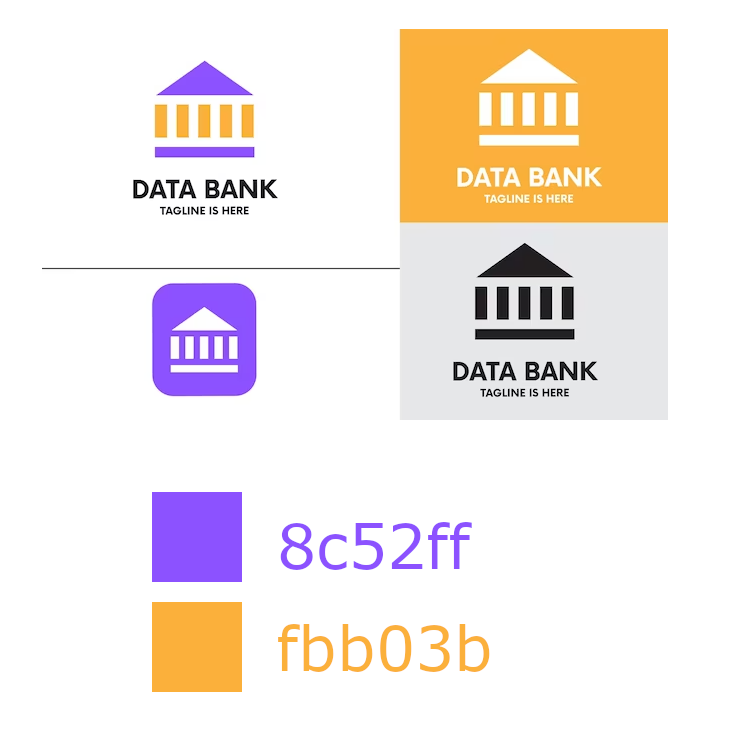

# Proyecto Banco

Proyecto de un sitio web para un banco que incluirá una variedad de funcionalidades. 

En la parte pública aparecerán un detalle de los productos del banco. Habrá un formulario para contactarse con ejecutivos del banco sobre los distintos productos que este ofrece.  

En la parte privada podrá revisar las consultas hechas por los clientes y administrar las categorías del catálogo de productos para canjear premios por Pesos Data Bank.

## Guía Estilo



- Títulos (Roboto 300)
- Párrafos (Roboto normal)

| Color             | Hex                                                                |
| ----------------- | ------------------------------------------------------------------ |
| Naranjo |  #fbb03b |
| Violeta |  #8c52ff |


## Inspiración 

https://alister-bank.cmsmasters.net/ 


## Demo

### Zona Pública
- https://stgoneira.github.io/desarrollo-frontend-banco/  
- https://stgoneira.github.io/desarrollo-frontend-banco/contacto.html

### Zona Privada
https://stgoneira.github.io/desarrollo-frontend-banco/admin  

**usuario:** admin@example.com  
**contraseña:** 123456 


## Fastify Server - API Reference

Desplegado en Glitch: https://dapper-shorthaired-doom.glitch.me 

#### Setup

Se ejecuta sólo si no hay ningún usuario en la BD.
```http
GET /setup
```

| Parameter | Type     | Description                |
| :-------- | :------- | :------------------------- |
|  |  |  |

#### Login

```http
POST /usuario/login
```

| Parameter | Type     | Description                       |
| :-------- | :------- | :-------------------------------- |
| `email`      | `string` | **Required**. Correo electrónico |
| `contrasena` | `string` | **Required**. Contraseña |


#### Guardar el contacto o consulta

```http
POST /contacto
```

| Parameter | Type     | Description                       |
| :-------- | :------- | :-------------------------------- |
| `nombre`    | `string` | **Required**. Nombre de quien contacta |
| `rut`       | `string` | **Required**. RUT de quien contacta |
| `telefono`  | `string` | **Required**. Teléfono de quien contacta |
| `email`     | `string` | **Required**. Correo electrónico de quien contacta |
| `motivo`    | `string` | **Required**. Motivo del contacto |
| `mensaje`   | `string` | **Required**. Mensaje o consulta |
| `direccion` | `string` | **Required**. Dirección de quien contacta |
| `comuna`    | `string` | **Required**. Comuna donde reside quien contacta |

#### Listar categorías de productos

```http
GET /categoria
```

| Parameter | Type     | Description                       |
| :-------- | :------- | :-------------------------------- |
|       |  |  |

#### Crear categoría de productos

```http
POST /categoria
```

| Parameter | Type     | Description                       |
| :-------- | :------- | :-------------------------------- |
| `nombre`      | `string` | **Required**. Nombre de la categoría |
| `descripcion` | `string` | **Required**. Descripción de la categoría |


#### Borrar una categoría de productos

```http
DELETE /categoria?id=${id}
```

| Parameter | Type     | Description                       |
| :-------- | :------- | :-------------------------------- |
| `id`      | `string` | **Required**. ID de la categoría |

