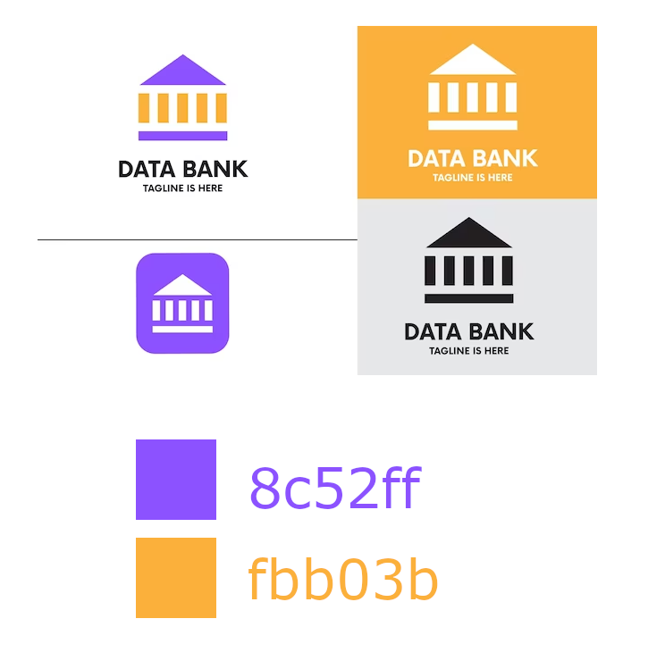

# Proyecto Banco

Proyecto de un sitio web para un banco que incluirá una variedad de funcionalidades. Para comenzar, se desarrollará la página de inicio de sesión, la cual permitirá a los usuarios ingresar a su cuenta y acceder a la información relacionada con sus cuentas, así como también hacer transferencias y ver su historial de transacciones.

Además, se trabajará en la creación de dos simuladores: el primero, un simulador de inversiones de depósitos a plazo, el cual permitirá a los usuarios calcular los intereses y el rendimiento de sus inversiones, y el segundo, un simulador de crédito de consumo, el cual les permitirá a los usuarios calcular la tasa de interés y el plazo de su crédito. Asimismo, se desarrollarán las páginas públicas, tales como la página de inicio, la página de descripción de productos y servicios, así como también un formulario de contacto para que los usuarios puedan comunicarse con el banco en caso de necesitar asistencia.

## Guía Estilo



- Títulos (Roboto 300)
- Párrafos (Roboto normal)

## Inspiración 

https://alister-bank.cmsmasters.net/ 


## API Reference

#### Setup

```http
GET /setup
```

| Parameter | Type     | Description                |
| :-------- | :------- | :------------------------- |
|  |  |  |

#### Login

```http
POST /usuario/login
```

| Parameter | Type     | Description                       |
| :-------- | :------- | :-------------------------------- |
| `email`      | `string` | **Required**. Correo electrónico |
| `contrasena` | `string` | **Required**. Contraseña |


